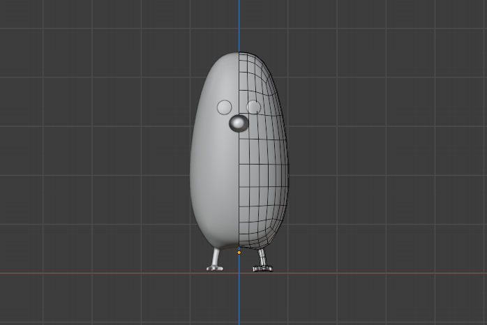
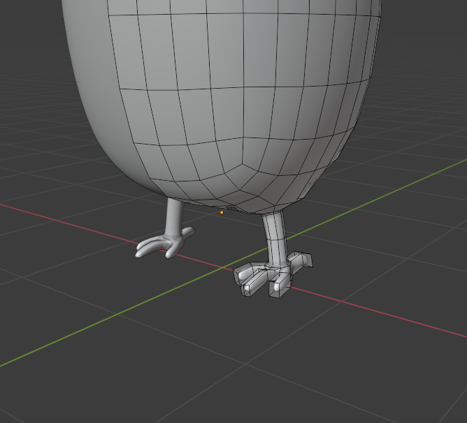
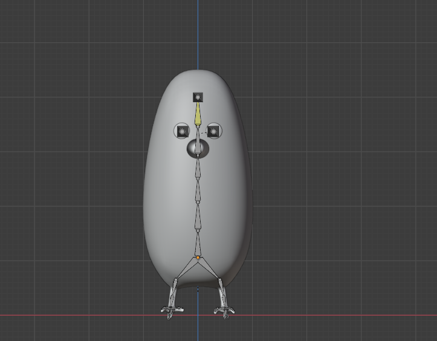
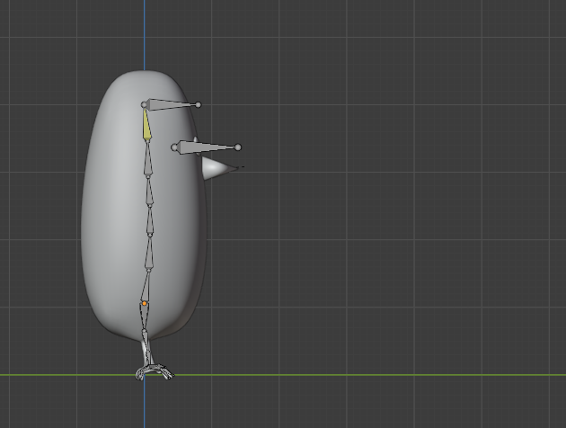

I've been experimenting with the particle hair simulation in Blender 3D to create fur and other effects on animated characters. I've recently completed a project that takes advantage of the dynamic hair physics in Blender.

<iframe src="https://player.vimeo.com/video/448938460" width="640" height="360" frameborder="0" allow="autoplay; fullscreen" allowfullscreen></iframe>

<a href="https://vimeo.com/448938460">Floofy Bird</a> from <a href="https://vimeo.com/user121610723">Matt Hall</a> on <a href="https://vimeo.com">Vimeo</a>.

## Inspiration

I'd like to credit the studio [CARBON](http://www.carbon.tv/), for the inspiration [^1]. For this project, I wanted to practice implementation and technical skill, not creativity.

## Process

### Modelling and Rigging

Before experimenting with particle hair physics, I wanted to build the model and rig. As these were not the focus of this project, I kept these very simple. I box modelled the character shape and feet using the Subdivision Surface and Mirror modifiers.

 

The rig is similarly simple. The feet are FK and the back is IK. All of the bones are named.

 

The eyes and nose are made of primitives and parented directly to the rig bones.

### Simulation
There are two simulations in this scene; the fur and the leaves. The leaves are really simple- particles emmitted from a plane blown by a wind field with keyframed strength.

The fur is far more complicated. I added a 

### Scene
I added a branch model[^2] for the bird to stand on and an HDR[^3] as the background. I chose to render in cycles for this scene, 

### Editing
I edited the shot in DaVinci Resolve, adding sound and trimming the first few frames where the hair stuck out.

## Things I learned
- Prewarm your simulations. I had a few frames at the beginning of the hair sim where the effects of the simulation weren't apparent. I should have started the animation a few frames in after giving the physics a second or so to stabilize.

## Addendum
[^1]: The [original post](https://www.instagram.com/p/B6IlwbYg_Jm/) by CARBON can be found on their Instagram.
[^2]: source to branch model
[^3]: source to HDRi